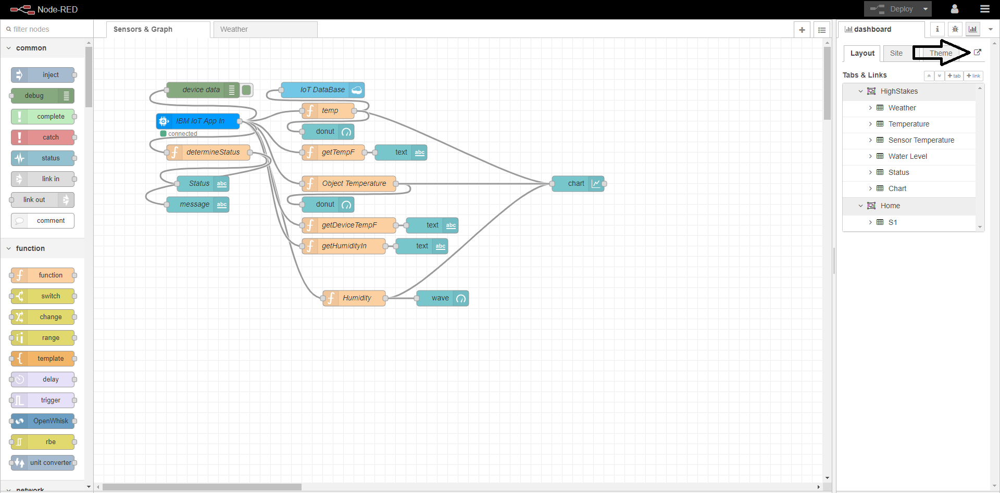

## Getting Started
This project was bootstrapped with [Create React App](https://github.com/facebook/create-react-app).

Note: The following instructions cover the necessary steps to run the FrontEnd application which is capable of fetching the simulated IoT data as well as fetch the current weather from your location (given permission). This values are then compared and based on a given threshold, will result in a status shown of either (STABLE, WARNING, or ALERT). This repo contains the BackEnd code developed using Node with the Express framework.


### Prerequisites

You need to have installed: \
 HighStakes Repository\
 [Node.js](https://nodejs.org/en/)

### Installing

Load your terminal and navigate to the folder containing the High
Stakes  directory, we used CMD but the process is the same in Linux console.\

```
C:\Users\User> cd (drag HighStakes from FileExplorer)
C:\Users\User\Documents\GitHub\HighStakes>
```


Once inside the project directory, we must install all necessary dependencies by running:

### `npm install`
```
C:\Users\User\Documents\GitHub\HighStakes>npm install
```


After the installs complete, we can start the application by running:

### `node app.js`

```
C:\Users\User\Documents\GitHub\HighStakes>node app.js
```
After it completes, do not close it and load another terminal and 
navigate to the folder containing the High
Stakes  directory.

```
C:\Users\User> cd (drag HighStakes from FileExplorer)
C:\Users\User\Documents\GitHub\HighStakes>
```


Once inside the project directory, we must install all necessary dependencies by running:

### `npm install`
```
C:\Users\User\Documents\GitHub\HighStakes>npm install
```


After the installs complete, we can start the application by running:

### `npm start`

```
C:\Users\User\Documents\GitHub\HighStakes>npm  start
```

Which runs the app in the development mode.<br />
Open [http://localhost:3000](http://localhost:3000) to view it in the browser if it doesn't open automatically. 

The page will reload if you make edits.<br />
## Data Acquisition Code

You can find the code for the Data Acquisition Code of the ESP [here](files/IoTDataAcquisitionCode.md)


## Live demo

You can find a running system to test at [http://hsnr.mybluemix.net/](http://hsnr.mybluemix.net/) \
### Here you can access the dashboard



